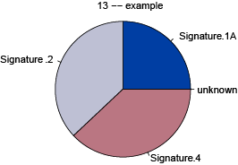

<!-- README.md is generated from README.Rmd. Please edit that file -->
deconstructSigs
===============

deconstructSigs aims to determine the contribution of known mutational processes to a tumor sample. By using deconstructSigs, one can:

-   Determine the weights of each mutational signature contributing to an individual tumor sample

-   Plot the reconstructed mutational profile (using the calculated weights) and compare to the original input sample

Once installed, deconstructSigs can be loaded:

``` r
  library(deconstructSigs)
```

Using deconstructSigs
---------------------

The most basic initial input to the deconstructSigs package consists of a data frame containing the mutational data for a tumor sample set.

This structure must contain the following:

-   sample identifier -- `sample.id`

-   chromosome -- `chr`

-   base position -- `pos`

-   reference base -- `ref`

-   alternate base -- `alt`

### `mut.to.sigs.input()`

Using the function `mut.to.sigs.input`, the mutational data for a set of tumors is converted to an n-row and 96-columns data frame where n is the number of unique samples present.

For instance, `sample.mut.ref` contains mutation data for two samples. Thus the output data frame will be 2x96 and contain the number of times a mutation is observed in each trinucleotide context.

``` r
head(sample.mut.ref)

# Convert to deconstructSigs input
sigs.input <- mut.to.sigs.input(mut.ref = sample.mut.ref, 
                                sample.id = "Sample", 
                                chr = "chr", 
                                pos = "pos", 
                                ref = "ref", 
                                alt = "alt")
#> Creating a generic function for 'nchar' from package 'base' in package 'S4Vectors'
```

### `whichSignatures()`

The output from `mut.to.sigs.input` can then be used as input to `whichSignatures`. Alternatively, a user can generate their own input data frame.

A signatures matrix S of k rows and 96 columns is also supplied as data in the package -- `signatures` -- or provided by the user , where k is the number of supplied signatures. S consists of the fraction of times a mutation is seen in each of the 96-trinucleotide contexts for each signature k.

The function `whichSignatures` takes these two inputs (`tumor.ref`, `signatures.ref`) and uses an iterative approach to determine weights to assign to each signature in order to best recontruct the mutational profile of the input tumor sample.

``` r
# Determine the signatures contributing to the two example samples
test = whichSignatures(tumor.ref = randomly.generated.tumors, 
                       signatures.ref = signatures, 
                       sample.id = 2)
```

If the input data frame only contains the counts of the mutations observed in each context, as is the case with the output from `mut.to.sigs.input`, then additional parameters must be given to `whichSignatures` to normalize the data.

In these cases, the value of `contexts.needed` should be TRUE and `trimer.counts.loc` should point to the location of a file containing the number of times each trinucleotide context is found in the sequencing region. Included with the package is `tri.counts.exome`, which contains the trinucleotide counts for an exome.

For the example used in `mut.to.sigs.input`, the call to `whichSignatures` would look as follows:

``` r
# Determine the signatures contributing to the two example samples
sample_1 = whichSignatures(tumor.ref = sigs.input, 
                           signatures.ref = signatures, 
                           sample.id = 1, 
                           contexts.needed = TRUE, 
                           trimer.counts.loc = tri.counts.exome)

sample_2 = whichSignatures(tumor.ref = sigs.input, 
                           signatures.ref = signatures, 
                           sample.id = 2, 
                           contexts.needed = TRUE, 
                           trimer.counts.loc = tri.counts.exome)
```

Additional parameters to `whichSignatures` are:

-   `associated` -- Vector of associated signatures. If given, will narrow the signatures tested to only the ones listed.

-   `signatures.limit` -- Number of signatures to limit the search to.

-   `signature.cutoff` -- Discard any signature contributions with a weight less than this amount.

### `plotSignatures()`

The output from `whichSignatures` can be visualized using the function `plotSignatures`. This function takes the `whichSignatures` output (`sigs.output`) and an optional identifying parameter (`sub`).

``` r
# Plot output
plotSignatures(sample_1)
plotSignatures(sample_2)
```


### `makePie()`

The output from `whichSignatures` can be visualized using the function `makePie`. This function takes the `whichSignatures` output (`sigs.output`) and an optional identifying parameter (`sub`).

``` r
# Plot output
makePie(sample_1)
makePie(sample_2)
```


