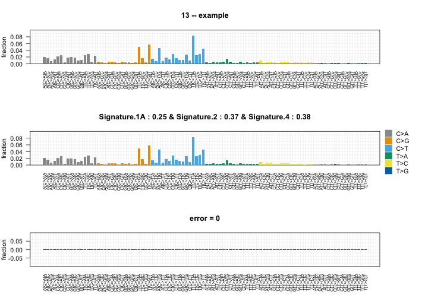

<!-- README.md is generated from README.Rmd. Please edit that file -->
deconstructSigs
===============

deconstructSigs aims to determine the contribution of known mutational processes to a tumor sample. By using deconstructSigs, one can:

-   Determine the weights of each mutational signature contributing to an individual tumor sample

-   Plot the reconstructed mutational profile (using the calculated weights) and compare to the original input sample

Once installed, deconstructSigs can be loaded:

``` r
  library(deconstructSigs)
```

Using deconstructSigs
---------------------

The most basic initial input to the deconstructSigs package consists of a data frame containing the mutational data for a tumor sample set.

This structure must contain the following columns:

-   sample identifier -- `sample.id`

-   chromosome -- `chr`

-   base position -- `pos`

-   reference base -- `ref`

-   alternate base -- `alt`

### `mut.to.sigs.input()`

Using the function `mut.to.sigs.input`, the mutational data for a set of tumors is converted to an n-row and 96-columns data frame where n is the number of samples present. Each column respresents how frequently a mutation is found within each trinucleotide context.

For instance, `sample.mut.ref` contains mutation data for two samples. Thus the output data frame will be 2x96 and contain the number of times a mutation is observed in each trinucleotide context for each sample ID.

``` r
head(sample.mut.ref)

# Convert to deconstructSigs input
sigs.input <- mut.to.sigs.input(mut.ref = sample.mut.ref, 
                                sample.id = "Sample", 
                                chr = "chr", 
                                pos = "pos", 
                                ref = "ref", 
                                alt = "alt")
#> Creating a generic function for 'nchar' from package 'base' in package 'S4Vectors'
```

### `whichSignatures()`

The output from `mut.to.sigs.input` can then be used as input to `whichSignatures`. Alternatively, a user can generate their own input data frame using calculated mutation information for each trinucleotide context per sample.

Two signatures matrices of k rows and 96 columns are also supplied as data in the package -- `signatures.nature2013` and `signatures.cosmic` -- where k is the number of defined signatures. The signatures matrix consists of the fraction of times a mutation is seen in each of the 96-trinucleotide contexts for each signature k. As novel signatures are identified, a user may choose to supply their own signatures matrix of the same format.

The function `whichSignatures` takes these two inputs (`tumor.ref`, `signatures.ref`) and uses an iterative approach to determine weights to assign to each signature in order to best recontruct the mutational profile of the input tumor sample.

``` r
# Determine the signatures contributing to the two example samples
test = whichSignatures(tumor.ref = randomly.generated.tumors, 
                       signatures.ref = signatures.nature2013, 
                       sample.id = 2)
```

#### `A bit about normalization`

If the input data frame only contains the counts of the mutations observed in each context, as is the case with the output from `mut.to.sigs.input`, then the data frame must be normalized. In these cases, the value of `contexts.needed` should be TRUE. An error will be raised if each row of the input data frame does not sum to 1.

Two additional parameters to `whichSignatures` dictate how any further normalization is done. By default these parameters, `tri.counts.exome.loc` and `tri.counts.genome.loc`, are set to NULL.

If only `tri.counts.exome.loc` is given, the input data frame is normalized by number of times each trinucleotide context is observed in the exome.

``` r
# Determine the signatures contributing to the two example samples
sample_1 = whichSignatures(tumor.ref = sigs.input, 
                           signatures.ref = signatures.nature2013, 
                           sample.id = 1, 
                           contexts.needed = TRUE, 
                           tri.counts.exome.loc = tri.counts.exome)
```

If only `tri.counts.genome.loc` is given, the input data frame is normalized by number of times each trinucleotide context is observed in the genome.

``` r
# Determine the signatures contributing to the two example samples
sample_1 = whichSignatures(tumor.ref = sigs.input, 
                           signatures.ref = signatures.nature2013, 
                           sample.id = 1, 
                           contexts.needed = TRUE, 
                           tri.counts.genome.loc = tri.counts.genome)
```

If both parameters are given, normalization is done to reflect the absolute frequency of each trinucleotide context as it would occur across the whole genome. Thus the count data for each trinucleotide context is multiplied by a ratio of that trinucleotide's occurence in the genome to the trinucleotide's occurence in the exome.

``` r
# Determine the signatures contributing to the two example samples
sample_1 = whichSignatures(tumor.ref = sigs.input, 
                           signatures.ref = signatures.nature2013, 
                           sample.id = 1, 
                           contexts.needed = TRUE, 
                           tri.counts.exome.loc = tri.counts.exome,
                           tri.counts.genome.loc = tri.counts.genome)

sample_2 = whichSignatures(tumor.ref = sigs.input, 
                           signatures.ref = signatures.nature2013, 
                           sample.id = 2, 
                           contexts.needed = TRUE, 
                           tri.counts.exome.loc = tri.counts.exome,
                           tri.counts.genome.loc = tri.counts.genome)
```

Included with the package is `tri.counts.exome`, which contains the trinucleotide counts for an exome and `tri.counts.genome`, which contains the trinucleotide counts for the hg19 genome.

#### `Optional parameters to whichSignatures()`

Additional optional parameters to `whichSignatures` are:

-   `associated` -- Vector of associated signatures. If given, will narrow the signatures tested to only the ones listed.

-   `signatures.limit` -- Number of signatures to limit the search to.

-   `signature.cutoff` -- Discard any signature contributions with a weight less than this amount.

#### `Output from whichSignatures()`

The output of `whichSignatures` is a list of 5 elements:

-   weights -- data frame containing the weights assigned to each of the k signatures of the input signatures matrix

-   tumor -- matrix of the trinucleotide contexts for the tumor sample used as input

-   product -- matrix obtained when the tumor matrix is multiplied by the assigned weights

-   diff -- matrix representing the difference between the tumor matrix and product matrix

-   unknown -- numeric weight not assigned to any of the input signatures

### `plotSignatures()`

The output from `whichSignatures` can be visualized using the function `plotSignatures`. This function takes the `whichSignatures` output (`sigs.output`) and an optional identifying parameter (`sub`).

``` r
# Plot output
plotSignatures(sample_1)
plotSignatures(sample_2)
```



### `makePie()`

The output from `whichSignatures` can be visualized using the function `makePie`. This function takes the `whichSignatures` output (`sigs.output`) and an optional identifying parameter (`sub`).

``` r
# Plot output
makePie(sample_1)
makePie(sample_2)
```


